# GithubSearchKMM

Github Repos Search - Kotlin Multiplatform Mobile using Jetpack Compose, SwiftUI,
 FlowRedux, Coroutines Flow, Dagger Hilt, Koin Dependency Injection, shared KMP ViewModel, Clean Architecture

[](https://github.com/hoc081098/GithubSearchKMM/actions/workflows/build.yml)
[](https://github.com/hoc081098/GithubSearchKMM/actions/workflows/ios-build.yml)
[](https://github.com/hoc081098/GithubSearchKMM/actions/workflows/gradle-wrapper-validation.yml)
[](https://android-arsenal.com/api?level=23)
[](http://kotlinlang.org)
[](https://hits.seeyoufarm.com)
[](https://opensource.org/licenses/MIT)
[](https://codecov.io/gh/hoc081098/GithubSearchKMM)
[](https://developer.apple.com/documentation/ios-ipados-release-notes/ios-ipados-14-release-notes)

Minimal **Kotlin Multiplatform** project with SwiftUI, Jetpack Compose.
 - Android (Jetpack compose)
 - iOS (SwiftUI)

Liked some of my work? Buy me a coffee (or more likely a beer)

<a href="https://www.buymeacoffee.com/hoc081098" target="_blank"></a>

### Modern Development
 - Kotlin Multiplatform
 - Jetpack Compose
 - Kotlin Coroutines & Flows
 - Dagger Hilt
 - SwiftUI
 - Koin Dependency Injection
 - FlowRedux State Management
 - Shared KMP ViewModel
 - Clean Architecture

## Tech Stacks
 - Functional & Reactive programming with **Kotlin Coroutines with Flow**
 - **Clean Architecture** with **MVI** (Uni-directional data flow)
 - **Multiplatform ViewModel**
 - **Multiplatform FlowRedux** State Management
 - [**Λrrow** - Functional companion to Kotlin's Standard Library](https://arrow-kt.io/)
   - [Either](https://arrow-kt.io/docs/apidocs/arrow-core/arrow.core/-either/)
   - [Monad Comprehensions](https://arrow-kt.io/docs/patterns/monad_comprehensions/)
   - [Option](https://arrow-kt.io/docs/apidocs/arrow-core/arrow.core/-option/)
   - [parZip](https://arrow-kt.io/docs/apidocs/arrow-fx-coroutines/arrow.fx.coroutines/par-zip.html)
 - Dependency injection
   - iOS: [**Koin**](https://insert-koin.io/)
   - Android: [**Dagger Hilt**](https://dagger.dev/hilt/)
 - Declarative UI
   - iOS: [**SwiftUI**](https://developer.apple.com/xcode/swiftui/)
   - Android: [**Jetpack Compose**](https://developer.android.com/jetpack/compose)
 - [Ktor client library](https://ktor.io/docs/getting-started-ktor-client-multiplatform-mobile.html) for networking
 - [Kotlinx Serialization](https://github.com/Kotlin/kotlinx.serialization) for JSON serialization/deserialization.
 - [Napier](https://github.com/AAkira/Napier) for Multiplatform Logging.
 - [FlowExt](https://github.com/hoc081098/FlowExt).
 - [MOKO KSwift](https://github.com/icerockdev/moko-kswift) is a gradle plugin for generation Swift-friendly API for Kotlin/Native framework.
 - [kotlinx.collections.immutable](https://github.com/Kotlin/kotlinx.collections.immutable): immutable collection interfaces and implementation prototypes for Kotlin..
 - Testing
   - [Kotlin Test](https://kotlinlang.org/docs/multiplatform-run-tests.html) for running tests with Kotlin Multiplatform.
   - [Turbine](https://github.com/cashapp/turbine) for KotlinX Coroutines Flows testing.
   - [Mockative](https://github.com/mockative/mockative): mocking for Kotlin/Native and Kotlin Multiplatform using the Kotlin Symbol Processing API.
   - [Kotlinx-Kover](https://github.com/Kotlin/kotlinx-kover) for Kotlin Multiplatform code coverage.

# Screenshots

## Android (Light theme)
|                                                  |                                                   |                                                  |                                                  |
|:------------------------------------------------:|:-------------------------------------------------:|:------------------------------------------------:|:------------------------------------------------:|
| 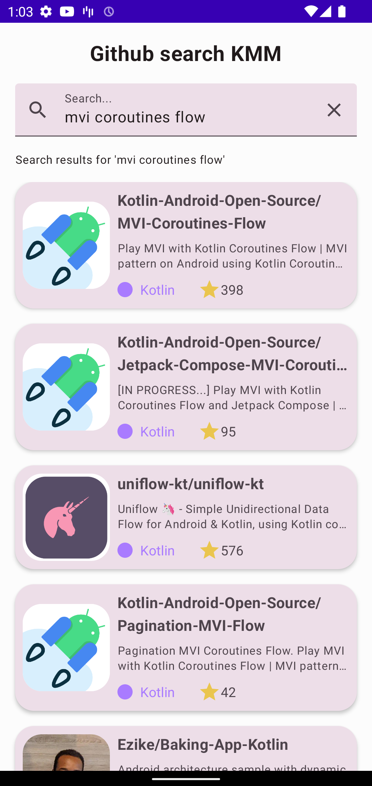 | 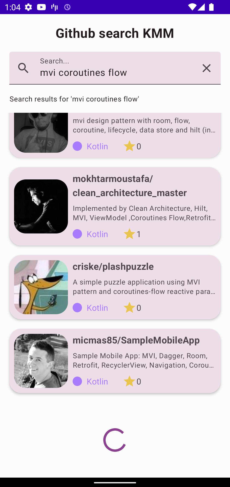  | 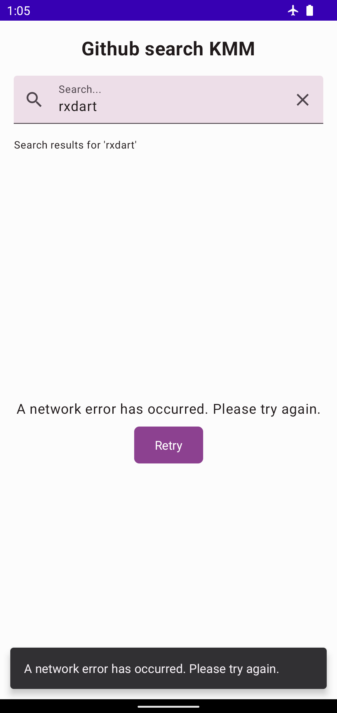 | 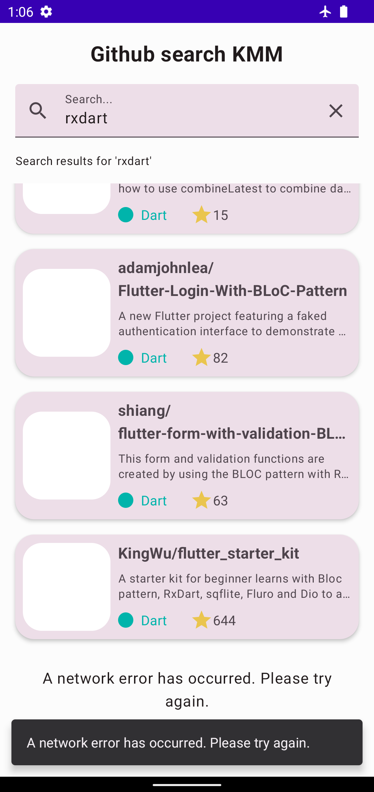 |

## Android (Dark theme)
|                                                  |                                                   |                                                  |                                                  |
|:------------------------------------------------:|:-------------------------------------------------:|:------------------------------------------------:|:------------------------------------------------:|
|   |  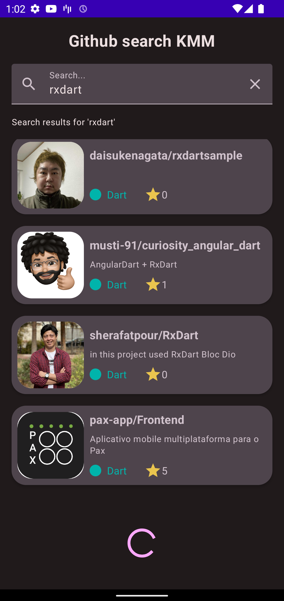  | 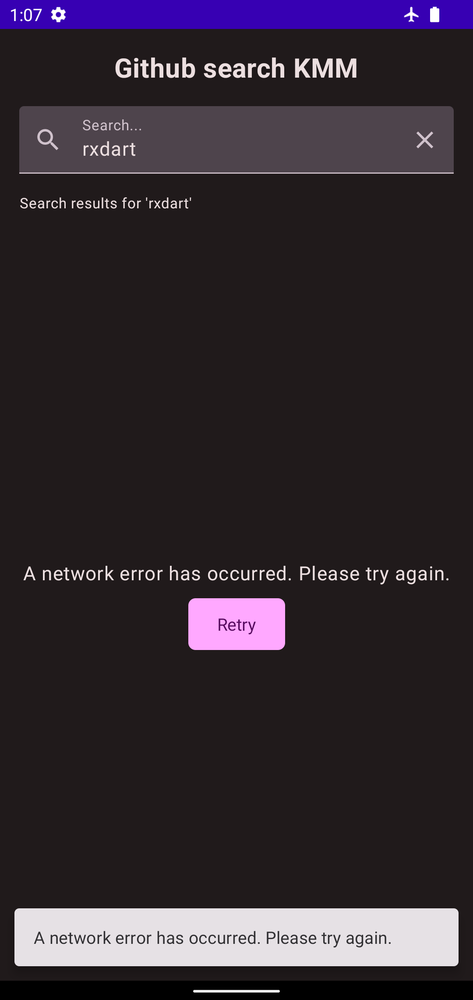  |   |

## iOS (Light theme)
|                                              |                                              |                                               |                                              |
|:--------------------------------------------:|:--------------------------------------------:|:---------------------------------------------:|:--------------------------------------------:|
| 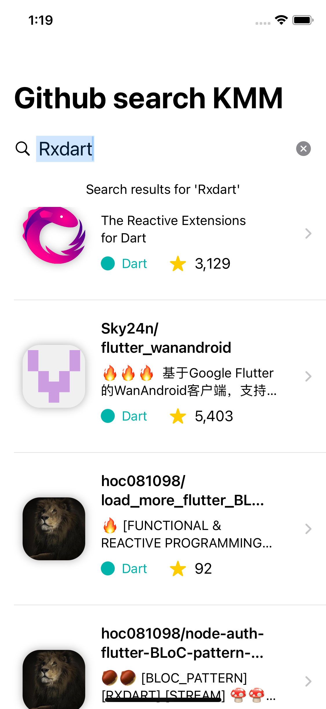 | 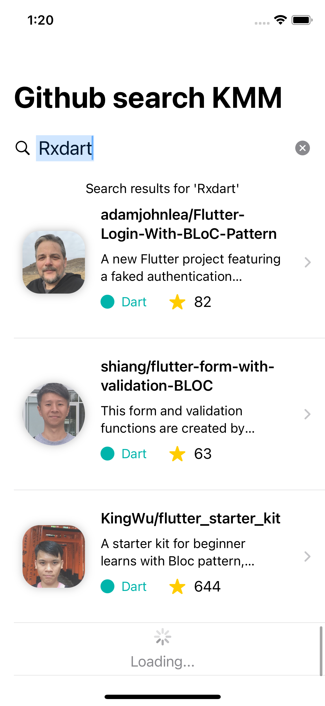 | 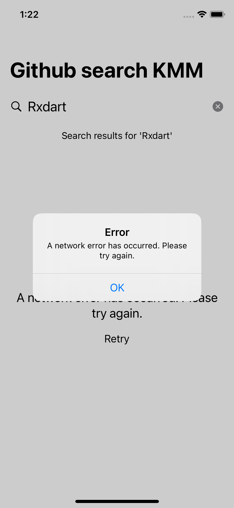  | 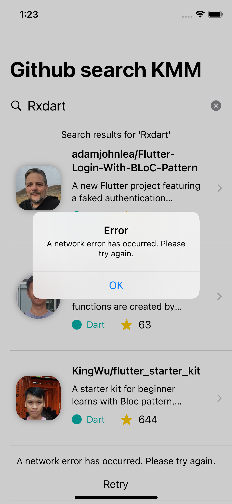 |

## iOS (Dark theme)
|                                             |                                             |                                              |                                             |
|:-------------------------------------------:|:-------------------------------------------:|:--------------------------------------------:|:-------------------------------------------:|
| 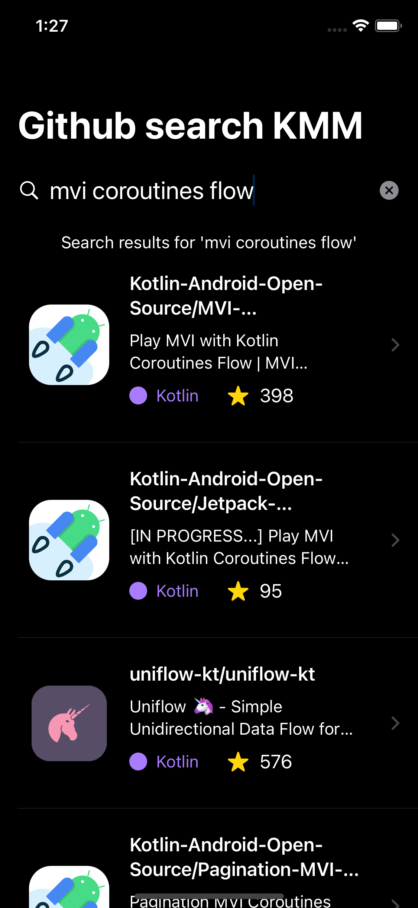 | 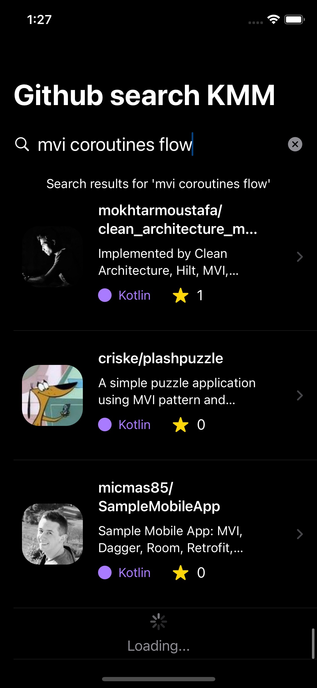 | 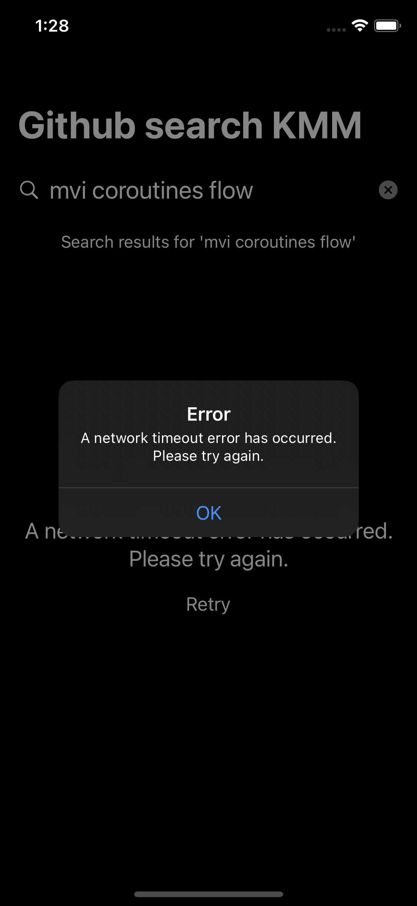  | 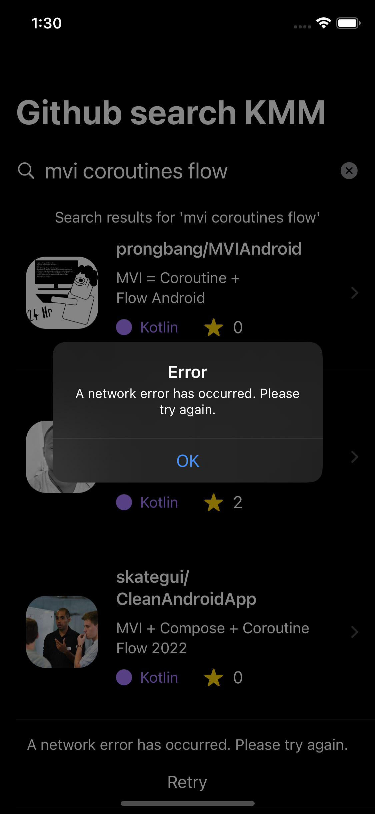 |

## Overall Architecture

### What is shared?
 - **domain**: Domain models, UseCases, Repositories.
 - **presentation**: ViewModels, ViewState, ViewSingleEvent, ViewAction.
 - **data**: Repository Implementations, Remote Data Source, Local Data Source.
 - **utils**: Utilities, Logging Library

### Unidirectional data flow - FlowRedux

 - My implementation. **Credits: [freeletics/FlowRedux](https://github.com/freeletics/FlowRedux)**
 - See more docs and concepts at [freeletics/RxRedux](https://github.com/freeletics/RxRedux)

<p align="center">
    
</p>

```kotlin
public sealed interface FlowReduxStore<Action, State> {
  /**
   * The state of this store.
   */
  public val stateFlow: StateFlow<State>

  /**
   * @return false if cannot dispatch action (this store was closed).
   */
  public fun dispatch(action: Action): Boolean

  /**
   * Call this method to close this store.
   * A closed store will not accept any action anymore, thus state will not change anymore.
   * All [SideEffect]s will be cancelled.
   */
  public fun close()

  /**
   * After calling [close] method, this function will return true.
   *
   * @return true if this store was closed.
   */
  public fun isClosed(): Boolean
}
```

### Multiplatform ViewModel

```kotlin
open class GithubSearchViewModel(
  searchRepoItemsUseCase: SearchRepoItemsUseCase,
  private val savedStateHandle: SavedStateHandle,
) : ViewModel() {
  private val effectsContainer = GithubSearchSideEffectsContainer(searchRepoItemsUseCase)

  private val store = viewModelScope.createFlowReduxStore(
    initialState = GithubSearchState.initial(),
    sideEffects = effectsContainer.sideEffects,
    reducer = Reducer(flip(GithubSearchAction::reduce))
      .withLogger(githubSearchFlowReduxLogger())
  )

  val termStateFlow: NonNullStateFlowWrapper<String> = savedStateHandle.getStateFlow(TERM_KEY, "").wrap()
  val stateFlow: NonNullStateFlowWrapper<GithubSearchState> = store.stateFlow.wrap()
  val eventFlow: NonNullFlowWrapper<GithubSearchSingleEvent> = effectsContainer.eventFlow.wrap()

  init {
    store.dispatch(InitialSearchAction(termStateFlow.value))
  }

  @MainThread
  fun dispatch(action: GithubSearchAction): Boolean {
    if (action is GithubSearchAction.Search) {
      savedStateHandle[TERM_KEY] = action.term
    }
    return store.dispatch(action)
  }

  companion object {
    private const val TERM_KEY = "com.hoc081098.github_search_kmm.presentation.GithubSearchViewModel.term"

    /**
     * Used by non-Android platforms.
     */
    fun create(searchRepoItemsUseCase: SearchRepoItemsUseCase): GithubSearchViewModel =
      GithubSearchViewModel(searchRepoItemsUseCase, SavedStateHandle())
  }
}
```

### Platform ViewModel

#### Android

Extends `GithubSearchViewModel` to use `Dagger Constructor Injection`.

```kotlin
@HiltViewModel
class DaggerGithubSearchViewModel @Inject constructor(
  searchRepoItemsUseCase: SearchRepoItemsUseCase,
  savedStateHandle: SavedStateHandle,
) : GithubSearchViewModel(searchRepoItemsUseCase, savedStateHandle)
```

#### iOS

Conform to `ObservableObject` and use `@Published` property wrapper.

```swift
import Foundation
import Combine
import shared
import sharedSwift

@MainActor
class IOSGithubSearchViewModel: ObservableObject {
  private let vm: GithubSearchViewModel

  @Published private(set) var state: GithubSearchState
  @Published private(set) var term: String = ""
  let eventPublisher: AnyPublisher<GithubSearchSingleEventKs, Never>

  init(vm: GithubSearchViewModel) {
    self.vm = vm

    self.eventPublisher = vm.eventFlow.asNonNullPublisher()
      .assertNoFailure()
      .map(GithubSearchSingleEventKs.init)
      .eraseToAnyPublisher()

    self.state = vm.stateFlow.value
    vm.stateFlow.subscribe(
      scope: vm.viewModelScope,
      onValue: { [weak self] in self?.state = $0 }
    )

    self.vm
      .termStateFlow
      .asNonNullPublisher(NSString.self)
      .assertNoFailure()
      .map { $0 as String }
      .assign(to: &$term)
  }

  @discardableResult
  func dispatch(action: GithubSearchAction) -> Bool {
    self.vm.dispatch(action: action)
  }

  deinit {
    Napier.d("\(self)::deinit")
    vm.clear()
  }
}
```

## Download APK

- [Download latest debug APK here](https://nightly.link/hoc081098/GithubSearchKMM/workflows/build/master/app-debug.zip)

# Building & Develop

- `Android Studio Chipmunk | 2021.2.1` (note: **Java 11 is now the minimum version required**).
- `XCode 13.2` or later (due to use of new Swift 5.5 concurrency APIs).
- Clone project: `git clone https://github.com/hoc081098/GithubSearchKMM.git`
- Android: open project by `Android Studio` and run as usual.
- iOS
  ```shell
  # Cd to root project directory
  cd GithubSearchKMM

  # Setup
  sh scripts/run_ios.sh
  ```

  There's a *Build Phase* script that will do the magic. 🧞 <br>
  <kbd>Cmd</kbd> + <kbd>B</kbd> to build
  <br>
  <kbd>Cmd</kbd> + <kbd>R</kbd> to run.

  When you see any error like this:
  ```
  ./GithubSearchKMM/iosApp/iosApp/ContentView.swift:4:8: No such module 'sharedSwift'
  ```
  You can run the following commands (must select `Read from disk` inside Xcode):
  ```shell
  # go to iosApp directory
  cd iosApp

  # install pods
  pod install
  ```
  Then, you can build and run inside Xcode as usual.

# LOC

```shell
--------------------------------------------------------------------------------
 Language             Files        Lines        Blank      Comment         Code
--------------------------------------------------------------------------------
 Kotlin                 105         7647          936          439         6272
 JSON                     7         3938            0            0         3938
 Swift                   16          903          118          102          683
 Markdown                 1          294           54            0          240
 Bourne Shell             2          250           28          116          106
 Batch                    1           92           21            0           71
 XML                      6           69            6            0           63
--------------------------------------------------------------------------------
 Total                  138        13193         1163          657        11373
--------------------------------------------------------------------------------
```
